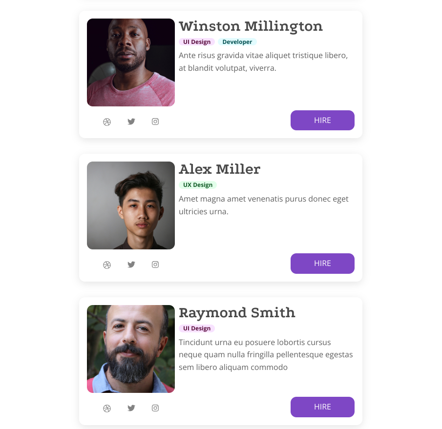

# Overlooked Fundementals

A Great Design Site for developers. In this site just HTML and CSS are used.





## Cloning the project 🪛🔨

```bash
# Clone this repository
$ git clone https://github.com/MastooraTurkmen/Overlooked-Fundementals

# Go inside the repository
cd Overlooked-Fundementals
```


-----

## Languages and Tools are used 🗣️🔧

1. **Languages** 🗣️

    + [HTML](https://github.com/topics/html)
    + [HTML5](https://github.com/topics/html5)
    + [CSS](https://github.com/topics/css)
    + [CSS3](https://github.com/topics/css3)

2. **Tools** 🔧
